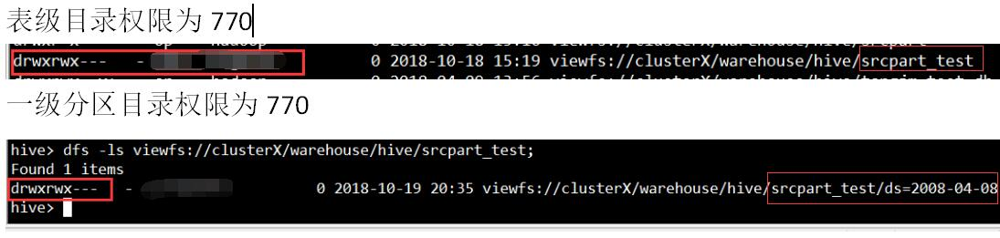
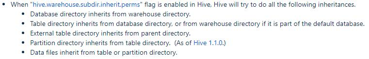

### 环境 
CDH5.12.1+Hadoop2.6+Hive1.1.0  
### 问题1
#### 问题描述
insert overwrite/into XX select * from XX
HDFS目录权限规范表级目录权限为770，手动创建；分区目录权限为755(umask值为022)。
设置Hive权限继承参数hive.warehouse.subdir.inherit.perms=false无效

官方说明：
https://cwiki.apache.org/confluence/display/Hive/Permission+Inheritance+in+Hive

#### 分析
### 问题2：删除分区报错
#### 问题描述
SQL：  
alter table srcpart drop partition(key='2008-04-08');  
集群HDFS权限规范，表级目录owner为hdfs。运行上述SQL的用户名为jimmy,用户jimmy已加入该目录写组
错误堆栈：  
FAILED: Execution Error, return code 1 from org.apache.hadoop.hive.ql.exec.DDLTask. Table partition not deleted since hdfs://xxx/xxx/srcpart(表名) is not writable by jimmy(用户名)
####分析
HiveMetaStore.HMSHandler.verifyIsWritablePath()

```java
  public boolean isWritable(Path path) throws IOException {
    if (!storageAuthCheck) {
	   //hive.metastore.authorization.storage.checks，配置文件中设为true。设置成true时，Hive将会阻止没有权限的用户进行表删除操作。
      // no checks for non-secure hadoop installations
      return true;
    }
    
    if (path == null) { //what??!!
      return false;
    }
    final FileStatus stat;
    try {
      //path即Hive表对应的HDFS目录,stat会获取path的详细信息
      stat = getFs(path).getFileStatus(path);
    } catch (FileNotFoundException fnfe){
      // File named by path doesn't exist; nothing to validate.
      return true;
    } catch (Exception e) {
      // all other exceptions are considered as emanating from
      // unauthorized accesses
      return false;
    }
    final UserGroupInformation ugi;
    try {
      //集群中开启Kerberos，这里ugi在问题场景中，就是用户jimmy的principal
      ugi = Utils.getUGI();
    } catch (LoginException le) {
      throw new IOException(le);
    }
    //这里user就是jimmy
    String user = ugi.getShortUserName();
    
    //检查目录的属主是否与jimmy一致，这里显然不一致（还有检查user是否对path有写权限）
    //check whether owner can delete
    if (stat.getOwner().equals(user) &&
        stat.getPermission().getUserAction().implies(FsAction.WRITE)) {
      return true;
    }
    //检查user所在的组是否包含path所属组，这也是为什么要在metastore上同步用户组
    //check whether group of the user can delete
    if (stat.getPermission().getGroupAction().implies(FsAction.WRITE)) {
      String[] groups = ugi.getGroupNames();
      if (ArrayUtils.contains(groups, stat.getGroup())) {
        return true;
      }
    }
    //check whether others can delete (uncommon case!!)
    if (stat.getPermission().getOtherAction().implies(FsAction.WRITE)) {
      return true;
    }
    return false;
  }
```


通常，Hive中的建表语句如下：
```sql
CREATE TABLE my_table(a string, b string, ...)
COMMENT 'This is the page view table'
PARTITIONED BY(dt STRING, country STRING)
ROW FORMAT DELIMITED
FIELDS TERMINATED BY '\001'
WITH SERDEPROPERTIES (
   "separatorChar" = "\t",
   "quoteChar"     = "'",
   "escapeChar"    = "\\"
)  
STORED AS TEXTFILE;
```
3、上述判读逻辑中有三个地方可以返回true（最后一个不计），也就相应有三个解决办法：

1）hive.metastore.authorization.storage.checks设为false；

2）修改表级目录属主为ocdc；

3）在metastore服务器上同步用户组（hdfs做同步用户无效）。

结合metastore安全和权限规范，最终只能选择第三种解决方案。